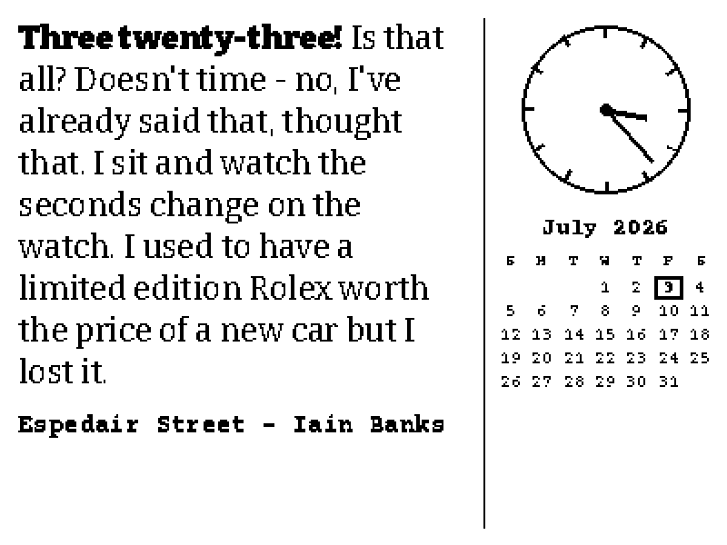

# Literary Clock — 2026 Edition

A literary clock for the [Pimoroni Inky wHAT](https://shop.pimoroni.com/products/inky-what)
(400 × 300, black & white e-ink) that tells the time using passages from
books — elevated with a split-panel layout, high-contrast typography, and a
live analog clock.

Every minute, the display shows a book quote that contains the current time.
The **time phrase within the quote is bolded** so you can read the time at a
glance, the **book and author** appear below in a contrasting typeface, and the
right panel shows a **two-hand analog clock** up top with a **month calendar**
below it, today's date boxed and bolded.



*Shown at 2× scale of the native 400 × 300 panel, rendered in true 1-bit black & white as the e-ink display shows it. Quote set in Bitter with the time phrase bolded; attribution, clock labels, and calendar set in Courier Prime.*

This project takes the idea from
[zenbuffy/LiteraryClock](https://github.com/zenbuffy/LiteraryClock) and
[the original Literary Clock](https://www.instructables.com/Literary-Clock-Made-From-E-reader/)
and rebuilds the presentation layer:

- **Split layout** — the quote occupies the left 2/3; a clock + month calendar occupies the right 1/3.
- **Live rendering** — frames are drawn on the fly each minute (no pre-generated image library to build or store).
- **Bolded time phrase** — the words that spell out the current time stand out in heavy weight.
- **Typographic contrast** — quote set in **Bitter** (a slab serif chosen because its even stroke weight stays crisp on 1-bit e-ink), attribution/date set in **Courier Prime**.
- **Two-hand analog clock** — a clean face (tick marks, no numbers) at the top of the right panel showing the current time.
- **Month calendar** — below the clock, a compact month grid with weekday headers and today's date boxed and bolded.
- **Auto-fit** — quote text scales to fit; long attributions wrap to a second line.

## Hardware

- Raspberry Pi (any model with the 40-pin GPIO header — Zero W, 3, 4, etc.)
- Pimoroni Inky wHAT, **black & white** (400 × 300)

## Repository layout

```
literary-clock-2026-edition/
├── literary_clock.py                 # rendering engine (produces a 400x300 PIL image)
├── litclock_annotated_improved.csv   # quotes: HH:MM|time phrase|quote|book|author
├── fonts/
│   ├── Bitter.ttf                    # quote body + bold time phrase (variable weight)
│   ├── CourierPrime.ttf              # attribution / date
│   ├── CourierPrime-Bold.ttf         # weekday
│   └── *-OFL.txt                     # font licenses (SIL OFL 1.1)
├── scripts/
│   ├── update_display.py             # renders the current minute and pushes to the panel
│   ├── install.sh                    # installs deps + systemd timer on the Pi
│   ├── literary-clock.service        # systemd oneshot unit
│   └── literary-clock.timer          # fires every minute
├── requirements.txt
├── LICENSE
└── README.md
```

## Quick start (on the Raspberry Pi)

Tested on **Raspberry Pi OS 13 "Trixie"**. Clone, run, reboot, go:

```bash
git clone https://github.com/RFNajera/literary-clock-2026-edition.git
cd literary-clock-2026-edition
./scripts/install.sh
sudo reboot
```

After the reboot the panel refreshes every minute on its own. The installer
enables SPI/I2C, installs the Pimoroni Inky driver + Pillow into a virtual
environment (required on Trixie — see below), and adds a per-minute cron job
that pauses overnight (01:00–06:00) to reduce e-ink wear.

Full details, verification steps, the systemd alternative, and troubleshooting
are in **[INSTALL.md](INSTALL.md)**.

### Note for Trixie / Bookworm (PEP 668)

Modern Raspberry Pi OS marks the system Python as "externally managed", so a
plain `pip install` is blocked. The display libraries therefore live in a
virtual environment at `~/.virtualenvs/pimoroni` (created by Pimoroni's
installer), and the cron job calls that environment's Python directly:

```cron
* * * * * /home/pi/.virtualenvs/pimoroni/bin/python3 /home/pi/literary-clock-2026-edition/scripts/update_display.py --sleep-start 1 --sleep-end 6
```

## Previewing without a display

You can render frames on any computer (no Inky required) to preview the layout:

```bash
pip3 install Pillow

# Render the current time to frame.png
python3 literary_clock.py --out frame.png

# Preview a specific time
python3 literary_clock.py --time 15:23 --out preview.png

# Same, through the driver (identical output, minus the panel push)
python3 scripts/update_display.py --preview preview.png
```

## Customizing

- **Quotes** — edit `litclock_annotated_improved.csv`. Each row is
  `HH:MM|time phrase|quote|book|author` (pipe-delimited). The `time phrase`
  must appear verbatim inside `quote`; that substring is what gets bolded.
- **Fonts** — swap the files in `fonts/` and update the `F_QUOTE` /
  `F_ATTRIB` paths at the top of `literary_clock.py`. If your quote font is a
  variable font with a Weight axis, the bolding uses weight 900 automatically.
- **Layout / clock** — the panel split, clock size, and margins are constants
  near the top of `literary_clock.py`.

## Credits & licensing

- Code: MIT (see [LICENSE](LICENSE)).
- Fonts: [Playfair Display](https://fonts.google.com/specimen/Playfair+Display)
  and [Courier Prime](https://fonts.google.com/specimen/Courier+Prime), SIL OFL 1.1.
- Quote dataset from [zenbuffy/LiteraryClock](https://github.com/zenbuffy/LiteraryClock).
  Individual quotes belong to their respective authors and publishers and are
  used here for a non-commercial, personal project.
